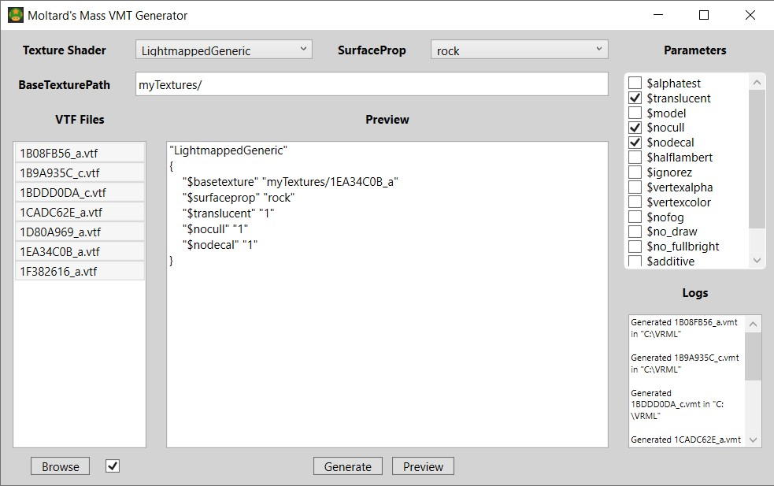

# Mass VMT Generator

A clean GUI tool that generate VMTs files for each VTF of a folder.

The tool design is based on **Pretador's VMT Generator** ( https://gamebanana.com/tools/5568 ) which had issue starting.

## Downloads

[MassVMTGenerator v1.1](https://github.com/Moltard/MassVMTGenerator/releases/latest)

## How to use

1. Use the **Browse** button to load a folder with VTF files. They will appear in the *VTF Files* list.
2. Select a **Texture Shader**.
3. Select a **SurfaceProp**.
4. Check the **Parameters** you want.
5. Write the **BaseTexture Path**, you want.
6. Select one or multiple VTF in the **VTF Files** list. You can use the small checkbox next to the **Browse** button to select all of them. You can also use shortcuts like *Ctrl+A*, *Ctrl*, *Shift* to select multiple files.
7. When one or multiple VTF are selected, the **Preview** and **Generate** buttons get unlocked.
8. Use the **Preview** button to see how the generated VMT will look like for the selected VTF (if multiple VTF files are selected, it will only preview for one of them).
9. Use the **Generate** button to generate the VMT for the selected VTF files.
10. The **Log** will tell you where the VMT files were created.
11. The VMT files names are the same as the VTF files names.

## Adding new Parameters

The parameters are not hardcoded into the tool, they are only located in the **JSON files** that come with the tool. 

So feel free to **edit them.** 

- *shader.json* - Contains the list of Shaders
- *surfaceprop.json* - Contains the list of SurfaceProp. All of them should be included, and they are sorted in the order of the most used.
- *parameters.json* - Contains the list of parameters. Only boolean parameters are supported (parameters which can only have a 0 or 1 value).

